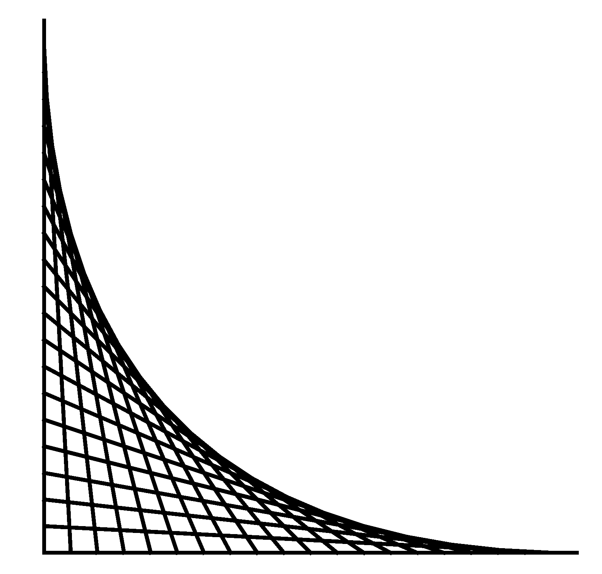
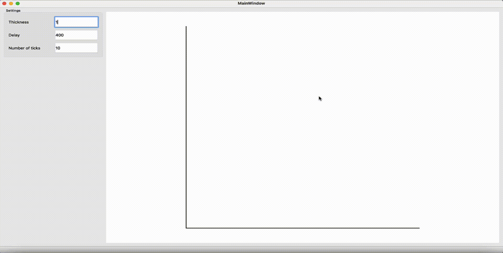
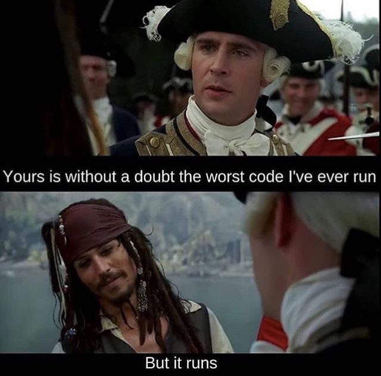

# Advanced Programming Course - HW6

<b>This is an OPTIONAL homework!</b>

 <b>Homework 6 - Fall 2022 Semester   Deadline: Jome 16 day - 11:59 pm</b> 

 
 

 

## **Outline**
Create a programm **with GUI** and draw this famous figure:

but you have to do it in an iterative way (draw each line one by one) and also put some settings on the screen so that the user can change some of the shape's specifications (like the tickness of the lines, the delay between drawing the lines, number of lines, and ...).

A very simple example of what you should do:
(see `resources/vid.gif` if *following figure* is not loading)

**Do not** use docker to imeplement your code and you can use either `Qt in C++` or `PyQt`.

 
 

<b>create a video of the final version of your program and upload it with your source files</b>

 
 

 <b>GOOD LUCK</b> 

 

 